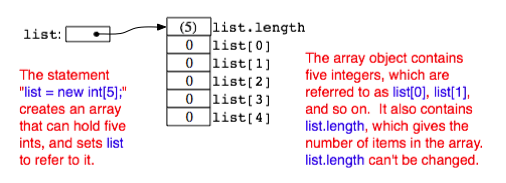
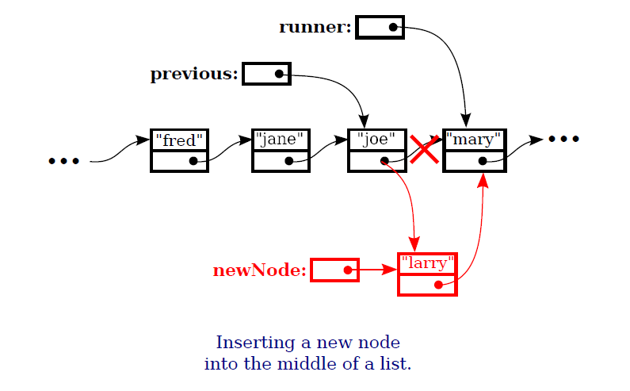
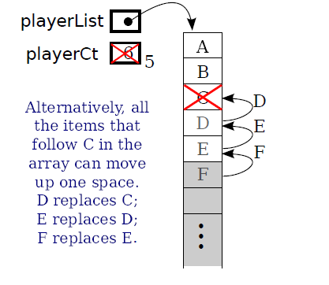

# Tecniche di collaborazione tra thread

---
@snap[noth-west]
Come facciamo a far si che due thread collaborino? Ad esempio un thread, *Thread A*, produce qualcosa di cui il *Thread B*, un altro thread 
ha bisogno. Il *Thread A* è il produttore e il *Thread B* è il consumatore. I due thread si devono coordinare: il consumatore deve aspettare che il produttore 
abbia prodotto, prima di prelevare l'elemento.
@snapend
---
@snap[west]
Il *Thread B*, consumatore e *Thread A*, produttore, eseguono questo codice, dove *obj* è qualche oggetto:

```java
// Thread B
if ( resultIsAvailable() == false )
    obj.wait(); // wait for notification that the result is available
useTheResult();
```

```
// Thread A
generateTheResult();
obj.notify(); // send out a notification that the result is available
```

Ora c'è qualche subdola race condition in questo codice. 
@snapend

---

@snap[north-west]
```java
// Thread B: consumatore
if ( resultIsAvailable() == false )
    obj.wait(); // wait for notification that the result is available
useTheResult();
```

```
// Thread A: produttore
generateTheResult();
obj.notify(); // send out a notification that the result is available
```
@snapend

@snap[south-west text-07]
I due thread potrebbero eseguire il loro codice nel seguente ordine:
@ol[]
1. Il *Thread A* controlla **resultIsAvailable()** è trova che il risultato non è disponibile, così decide di invocare **obj.wait()**, ma prima che lo faccia, @note[nota 1]
1. Il *Thread B* termina di generare il risultato e invoca **obj.notify()** @note[nota 2]
1. Il *Thread A* chiama **obj.wait()** per aspettare la notifica che il risultato è disponibile. @note[note 3]
@olend

Nello Step 3, il *Thread A* sta aspettando per una notifica che non arriverà mai, perché **notify()** è già stata invocata nello Step 2. 
Questo è un tipo di deadlock che lascia il *Thread A* aspettare per sempre.

@snapend

---
@snap[north-west text-07]
Quindi ci vuole qualche tipo di sincronizzazione. La soluzione è includere sia il codice di *Thread A* che di *Thread B* nello statement **synchronized**, ed è molto naturale sincronizzare sullo stesso oggetto, obj, che è utilizzato per le chiamate di **wait()** e **notify()**. 
<br><br>In effetti, siccome la sincronizzazione sarebbe quasi sempre obbligatoria quando  si utilizzano wait() e notify(), **Java lo rende un requisito obbligatorio**. 
<br><br>
In Java, un thread può legalmente invocare **obj.wait()** e **obj.notify()** solo se il thread ha acquisito il lock di sincronizzazione associato all'oggetto **obj**. 
<br><br>Se non ha acquisito prima il lock, allora viene lanciata un'eccezione. (L'eccezione è di tipo *java.lang.IllegalMonitorStateException*, che è di tipo runtime 
e quindi non deve essere gestita obbligatoriamente). Una ulteriore complicazione è che il metodo wait() può lanciare l'eccezione *java.lang.InterruptedException* 
e quindi deve essere invocata nello statement di  try che cattura quella eccezione.
@snapend
---

@snap[north-west text-06]
### Produttore/consumatore semplificato (un solo elemento)
Facciamo ad esempio il caso di un risultato calcolato da un thread che deve essere reso disponibile ad un altro thread. 
Assumendo che c'è una variabile condivisa **sharedResult** che è utilizzata per trasferire il risultato dal produttore al consumatore. 
Quando il risultato è pronto, il produttore setta il valore della variabile a un valore non nullo. 
Il consumatore può controllare se il risultato è pronto controllando se il valore della variabile **sharedResult** è nullo. 
Utilizziamo la variabile **lock** per sincronizzare.
@snapend

---

@snap[north-west]
### Array di tipo primitivo - esempio
@snapend

```java
int[] list = new int[5];
```

---

@snap[north-west]
#### Array di oggetti - esempio
@snapend

```java
Shape[] shapes = new Shape[100]; // Array to hold up to 100 shapes.
shapes[0] = new Rect();          // Put some objects in the array.
shapes[1] = new Line(); 
shapes[2] = new FilledOval();
``` 


---

### Arrays utilities
Metodi statici della classe java.utils.Arrays utili per lavorare con gli array.
---

- Arrays.fill( array, value) - Riempie tutto l'array con il valore specificato. Il tipo del valore deve essere compatibile con il tipo base dell'array. Per esempio, assumendo che numList è un array di double[], allora Arrays.fill( numList, 17), settera ogni elemento di numList al valore 17;
- Arrays.fill( array, fromIndex, toIndex, value) - Riempie parte dell'array con value, partendo da fromIndex e finendo a toIndex -1, Da notare che toIndex non è incluso.

---

- Arrays.toString( array) -  Una funzione che ritorna una String contenente tutti gli elementi dell'array, separati da virgole e inclusi tra parentesi quadre. I valori dell'array, sono convertiti a String, nello stesso modo in cui sarebbero stampati a standard output. 
- Arrays.sort( array) -  Ordina un intero array. Ordinare un array significa disporre gli elementi dell'array in ordine crescente. Il metodo funziona per tipi primitivi (eccetto i boolen) e per oggetti che implementano l'interfaccia Comparable;
- Arrays.sort( array, fromIndex, toIndex) -  Ordina solo gli elementi da array[fromIndex] a array[toIndex -1];

---

- Arrays.binarySearch( array, value) - Ricerca il valore nell'array. Prerequisito è che l'**array sia già ordinato** in ordine crescente. La funzione ritorna un `int`. Se il valore è ritrovato nell'array, ritorna il valore dell'indice dell'elemento nell'array. Se il valore invece non è presente, viene ritornato il valore -1;

---

#### Arrays.copyOf

Il metodo copyOf è utile per fare una copia di un array di partenza:
```java
A = Arrays.copyOf( list, lengthOfCopy )
```
restituisce un array, dato un array di input (list nel nostro esempio), della dimensione specificata. Se la lengthOfCopy è maggiore della lunghezza dell'array di input, l'array di output avrà gli elementi eccedenti valorizzati con il valore di default per il tipo base dell'array. Se invece lengthOfCopy  è <=  di list.length, viene compiato nel nuovo array solo il numero di elementi da list che ci stanno nel nuovo array.

---

Così se A è un array:
```java
B = Arrays.copyOf( A, A.length );
```
otteniamo un array B della stassa lunghezza di A con copia degli stessi elementi, e con questo codice:
```java
playerList = Arrays.copyOf( playerList, 2*playerList.length );
```
possiamo raddoppiare la dimensione di un array, in questo caso playerList.

---
@snap[west]
Abbiamo visto che per istanziare un array (crearlo), dobbiamo dire di quanti elementi è composto. Una volta creato, la dimensione non può essere cambiata. <br><br>
Se volessimo una strutura dati, che non sia necessario a priori stabilire la dimensione? Chiameremo questa struttura **array dinamici**. Vediamo come implementarla.
@snapend
---
## DYNAMIC ARRAY
Implementiamo un array dinamico da un array base. In questo caso un arrray di `int`.

---?gist=MassimoCappellano/14094c0aabca84f4f2eb9e24a81fb496&lang=Java&title=Dynamic Array of ints

@[1-9](attributi private `items` e `itemCt`)
@[10-35](get item, set item e size())
@[36-58](add item e remove item)

---
Se avessi avuto bisogno di un array dinamico di `String`?

---?gist=MassimoCappellano/0d4dad68bf46818770793bc2576e2afb&lang=Java&title=Dynamic array of strings

@[1-9](attributi private `items` e `itemCt`)
@[10-35](get item, set item e size())
@[36-58](add item e remove item)

---
E un array dinamico di una mia classe ad esempio `Persona`?
---?gist=MassimoCappellano/f635ef66e0a4ec1b156a392cccf923ed&lang=Java&title=Dynamic array of Person 

---
@snap[west]
Le tre classi (`DynamicArrayOfInt`, `DynamicArrayOfString`, `DynamicArrayOfPerson`), che sono array dinamici, sono molto simili nella implementazione, come si può notare. 
<br><br>
Vediamo che la logica di base non cambia molto, cambia solo il tipo di contenuto: un array di `int` o un array di `String` o un array di una classe da noi definita, es `Person`.
@snapend

---
@snap[north-west]
### Tipi Parametrici
@snapend

@snap[west]
 Per questo sono stati definiti i **tipi parametrici**, tipi che sono customizzati in base al tipo contenuto. Vederemo nelle prossime lezioni di trattare l'argomento sui tipi parametrici.
<br><br>
Per ora vediamo solo come utilizzare tipi paramentrici già definiti. Il primo esempio che vedremo è `java.util.ArrayList<E>`
@snapend
---

@snap[north-west]
### Tipi Parametrici
@snapend

@snap[west]
A mo' d'esempio, nella prossima slide vediamo la classe, diventata generica, implementata come tipo parametrico. 
<br><br>
Quando tratteremo i tipi parametrici questo codice vi risulterà chiaro.
@snapend

---?gist=MassimoCappellano/489a4111f3a941e2c7ba4daa552ab520&lang=Java&title=Esempio Dinamic Array come tipo parametrico

Notate `<T>` a fianco al nome della classe. `T` come tipo generico.

---?gist=MassimoCappellano/1007e91a902fe452cb18f271ef8abf7d&lang=Java&title=Esempio di utilizzo DinamicArrayGeneric

---
@snap[north-west]
#### Utilizzo della classe `ArrayList` come array dinamico
@snapend

@snap[west]
`java.util.ArrayList` è una delle classi standard del JDK, fa parte del Java Collection Framework, ed è un tipo di array dinamico.
<br><br>
E' un tipo parametrico [`java.util.ArrayList<E>`](https://docs.oracle.com/javase/7/docs/api/java/util/ArrayList.html) che implementa l'interfaccia [`java.util.List<E>`](https://docs.oracle.com/javase/7/docs/api/java/util/List.html).
@snapend

---
@snap[north-west]
#### Esempio `ArrayList` come tipo parametrico
@snapend

```java
ArrayList<String> nameList = new ArrayList<String>();

ArrayList<Player> playerList = new ArrayList<Player>();
		
nameList.add("Massimo");
nameList.add("Giovanni");
nameList.add("Carla");
		
playerList.add(new Player("Cristiano Ronaldo", "Juventus"));
playerList.add(new Player("Mauro Icardi", "Inter"));
playerList.add(new Player("Ciro Immobile", "Lazio"));
playerList.add(new Player("Dries Mertens", "Napoli"));
playerList.add(new Player("Mario Mandžukić", "Juventus"));

for(String name: nameList) {
  System.out.println(name);
}
		
for(Player player: playerList) {
  System.out.println(player);
}
```

@snap[south-west]
Instanziazione di due `ArrayList`, una di oggetti `String` e una di `Player`, classe di esempio.
@snapend

---

@snap[north-west]
Possimamo notare dall'output che l'`ArrayList` conserva l'ordine di inserimento. 
@snapend

```text
Massimo
Giovanni
Carla
Player [name=Cristiano Ronaldo, squadra=Juventus]
Player [name=Mauro Icardi, squadra=Inter]
Player [name=Ciro Immobile, squadra=Lazio]
Player [name=Dries Mertens, squadra=Napoli]
Player [name=Mario Mandžukić, squadra=Juventus]

```
@snap[south-west]
**E' una caratteristica importante delle classi che implementato `java.util.List`, mantenere l'ordinamento**.
@snapend
---

@snap[north-west]
#### Metodi di `List`
@snapend

@snap[span-100]
@ul[spaced text-red]
- `list.size()`
- `list.add(obj)`
- `list.get(N)`, lancia IndexOutOfBoundException se N >= list.size()
- `list.set(N, obj)`
- `list.clear()`
- `list.remove(N)`
- `list.remove(obj)`
- `list.indexOf(obj)`
@ulend
@snapend

---
@snap[west]
Gli ultimi due metodi, `list.remove(obj)` e `list.indexOf(obj)`, utilizzano `obj.equals(Object o)` per trovare l'oggetto da rimuovere o la posizione dell'oggetto nella lista.
<br><br>
E' importante che quindi il metodo `equals` sia reimplementato secondo la logica di confronto per noi opportuna.
@snapend

---

Data una classe `Player`:

```java
public class Player {
	
	private String name;
	private String squadra;
	
	public Player(String name, String squadra) {
		this.name = name;
		this.squadra = squadra;
	}

	@Override
	public String toString() {
		return "Player [name=" + name + ", squadra=" + squadra + "]";
	}
		
}
```
---

```java
import java.util.ArrayList;

public class EsempioArrayList2 {

	public static void main(String[] args) {
		
		ArrayList<Player> playerList = new ArrayList<Player>();
		
		playerList.add(new Player("Cristiano Ronaldo", "Juventus"));
		playerList.add(new Player("Mauro Icardi", "Inter"));
		playerList.add(new Player("Ciro Immobile", "Lazio"));
		playerList.add(new Player("Dries Mertens", "Napoli"));
		playerList.add(new Player("Mario Mandžukić", "Juventus"));
		
		for(Player player: playerList) {
			System.out.println(player);
		}
		
		int index = playerList.indexOf(new Player("Mauro Icardi", "Inter"));
		
		System.out.println("index: " + index);
		
		boolean isRemoved = playerList.remove(new Player("Mauro Icardi", "Inter"));
		
		System.out.println("Dopo la remove di 'Icardi'");
		
		for(Player player: playerList) {
			System.out.println(player);
		}
	}

}
```

Rimuoviamo un elemento

---

#### Output:

```text
Player [name=Cristiano Ronaldo, squadra=Juventus]
Player [name=Mauro Icardi, squadra=Inter]
Player [name=Ciro Immobile, squadra=Lazio]
Player [name=Dries Mertens, squadra=Napoli]
Player [name=Mario Mandžukić, squadra=Juventus]
index: -1
Dopo la remove di 'Icardi'
Player [name=Cristiano Ronaldo, squadra=Juventus]
Player [name=Mauro Icardi, squadra=Inter]
Player [name=Ciro Immobile, squadra=Lazio]
Player [name=Dries Mertens, squadra=Napoli]
Player [name=Mario Mandžukić, squadra=Juventus]

```
Vediamo che l'elemento però c'è ancora. Come mai?

---

```java
package team;

public class Player {
	
	private String name;
	private String squadra;
	
	public Player(String name, String squadra) {
		this.name = name;
		this.squadra = squadra;
	}
	
	@Override
	public boolean equals(Object obj) {
		if (this == obj)
			return true;
		if (obj == null)
			return false;
		if (getClass() != obj.getClass())
			return false;
		Player other = (Player) obj;
		if (name == null) {
			if (other.name != null)
				return false;
		} else if (!name.equals(other.name))
			return false;
		if (squadra == null) {
			if (other.squadra != null)
				return false;
		} else if (!squadra.equals(other.squadra))
			return false;
		return true;
	}

	@Override
	public String toString() {
		return "Player [name=" + name + ", squadra=" + squadra + "]";
	}
		
}
```
Reimplementiamo `equals` in `Player` per fare il confronto sui valori.

--- 

Utilizzando la nuova versione della classe `Player`, vediamo l'output:

```text
Player [name=Cristiano Ronaldo, squadra=Juventus]
Player [name=Mauro Icardi, squadra=Inter]
Player [name=Ciro Immobile, squadra=Lazio]
Player [name=Dries Mertens, squadra=Napoli]
Player [name=Mario Mandžukić, squadra=Juventus]
index: 1
Dopo la remove di 'Icardi'
Player [name=Cristiano Ronaldo, squadra=Juventus]
Player [name=Ciro Immobile, squadra=Lazio]
Player [name=Dries Mertens, squadra=Napoli]
Player [name=Mario Mandžukić, squadra=Juventus]
```
vediamo che ora l'elemento viene rimosso!!!

---?gist=MassimoCappellano/f4bc46f00f82a9c361e4fe23bf1f70bd&lang=Java&title=Esempio con ArrayList

---
@snap[west]
Abbiamo visto come, da tipo array, si possono costruire array dinamici. La classe del JDK `java.util.ArrayList` ha il comportamento degli array dinamici ed è implementata internamente, come dice il nome, con un array che contiene gli elementi.
<br><br>
La classe `ArrayList` implementa l'interfaccia `java.util.List`.
<br><br>
Anche la classe `java.util.LinkedList` implementa l'interfaccia `java.util.List`.
@snapend

---


@snap[west]

@img[shadow](assets/img/ArrayListVsLinkedList.png)
<br>
Le differenze tra `ArrayList` e `LinkedList` dipendono dalla struttura dati interna utilizzata: un array nel caso di `ArrayList`, mentre, nel caso della `LinkedList`, è utilizzata una lista dinamica. I metodi che espongono sono uguali perchè ambedue implementano l'intarfaccia `java.util.List`.
<br><br>
Vediamo cos'è una **lista dinamica**.
@snapend

---

#### Lista dinamica  

Struttura dati definita in modo ricorsivo.

```java
class Node {
  String item;
  Node next;  
}
```


Gli elementi vengono man mano aggiunti alla fine della lista. L'ultimo elemento ha il campo `next = null`.

---

### Aggiunta di un elemento all'interno della lista



---
Mentre l'aggiunta di un elemento all'interno dell'array, non sarebbe così semplice. Verrebbe dire spostare in avanti di 1 tutti gli elementi seguenti quello da inserire.

La cancellazione invece vorrebbe dire spostare di 1 indietro tutti gli elementi dopo quello da cancellare.



---
@snap[west]
Si può riassumere dal confronto tra le due strutture dati:
@ul 
- l'accesso ad un elemento di un array è indipendente dalla dimensione dell'array, mentre per la lista dinamica, dovendo scorrere uno a uno gli elementi, dipende dalla posizione dell'elemento;
- inserimento e cancellazione di elementi nella lista dinamica è molto meno dispendiosa (basta spostare le reference) rispetto alla stessa operazione nell'array, dove vanno spostati in avanti o indietro tutti gli elementi successivi all'elemento da inserire o cancellare.
@ulend
@snapend

---
@snap[west]
Per questo motivo  `ArrayList` è da preferire come implementazione quando abbiamo da fare tanti accessi casuali alla lista con operazioni di `get` e `set`. 
<br><br>
Mentre `LinkedList` è da preferire quando principalemnte vengono eseguite operazioni di modifica della lista, quindi operazioni di `add` e `remove`.
@snapend
---
@snap[north-west]
#### Riepilogo
@snapend

@snap[west]
<ol>
<li>Struttura dati array dinamico, esempi di implementazione;</li>
<li>Esempio di tipo parametrico;</li>
<li>`ArrayList` come array dinamico;</li>
<li>Metodi dell'interfaccia `List`;</li>
<li>`LinkedList` come differente implementazione di `List`;</li>
<li>Differenze tra `ArrayList` e `LinkedList`;</li>
</ol>
@snapend

@snap[south span-100 text-06]
[Vai a @fa[external-link]](https://checksound.gitbook.io/corsojava/array-and-arraylist)
@snapend


